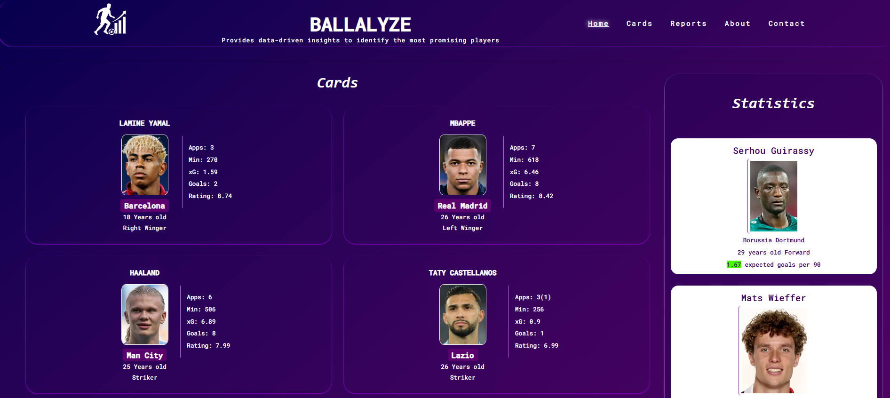
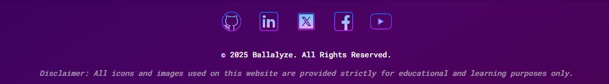

# Ballalyze ⚽📊

Ballalyze is a football data analytics demo project built with **HTML5** and **CSS3**.
The goal of this project is to practice semantic HTML structure, accessibility features (ARIA roles, labels), and modern layout techniques using **CSS Grid** and **Flexbox**.

Ballalyze enables users to explore player statistics, compare performance metrics, and gain insights through a clean and modern interface.
The project is intended for football enthusiasts and recruiters looking to analyze player performance.


*The project is deployed on GitHub Pages and can be viewed* [here](https://tarik-box.github.io/PP1-Idea-0/)

---

## Features:

### Existing Features

* **Navigation Bar**

The navigation bar is available across all pages. It helps users easily navigate between sections (Home, About, Reports, Contact, and Statistics 'on smaller Devices') .

The active page is highlighted and underlined for better orientation.


* **The landing page**

The landing page introduces the project with a clear headline and football-themed visuals, helping users immediately understand the website’s purpose.



* **Player Cards Section**

Displays featured players with quick insights. This provides users with a quick overview of performance highlights without requiring them to delve into detailed reports.


* **Reports Page**

Provides a summarized performance report for 'Player of the week'. This feature helps recruiters and enthusiasts access quick evaluations of players.


* **Statistics Section**

On large devices, it is integrated directly into the main page, while on smaller devices, it appears as a dedicated page. It highlights key player attributes in a visual way.


* **About Page**

Explains the goal and scope of the project. This ensures new users understand the vision and target audience of Ballalyze.


* **Contact Page**

Includes a simple contact form where users can send messages. It improves communication and allows feedback or inquiries about the project.


* **Responsive Design**

The site is fully responsive across devices (desktop, laptop, tablet, mobile). This ensures accessibility and usability for all screen sizes.

* **Footer Section**

Contains relevant information and links. It gives users a consistent closing element across the site, supporting navigation and project credibility.



### Features Left to Implement

- Make player cards dynamic by integrating real-time data via APIs.
- Connect the project to a backend database for efficient data management.
- Expand reporting capabilities with detailed and customizable player analytics.
- Add advanced search and comparison pages for deeper insights.
- Explore additional features and enhancements as the project evolves.

---

## Project Structure

##### Assets:

│── assets/
│   ├── images/       # Project Images
│   ├── icons/        # Project Icons
│   └── css/style.css # CSS styling

##### Pages:

│── index.html       # Main HTML file
│── about.html       # About page
│── contact.html     # Contact page
│── reports.html     # Report page
│── statistics.html  # Statistics page

##### Documentation:

│── README.md        # Project documentation

---

## Technologies Used

- **HTML5**
- **CSS3** (Grid, Flexbox, animations)

---

## Validation

All HTML and CSS files have been checked using the official validators:

### HTML Validation

All HTML pages (`index.html`, `about.html`, `contact.html`, `reports.html`, `statistics.html`) were tested using the [W3C Markup Validation Service](https://validator.w3.org/nu/?doc=https%3A%2F%2Ftarik-box.github.io%2FPP1-Idea-0%2F).
All pages passed with no errors.

### CSS

The CSS file (`style.css`) was tested using the [W3C Jigsaw CSS Validation Service](https://jigsaw.w3.org/css-validator/).

- **Style File**

✅ Validation passed with **no errors**.
  ⚠️ *One minor warning is shown related to Google Fonts import, which is an external resource and not part of the authored CSS.*


---


## Author

Created by *Tarik Ataia*
This project is part of my front-end development learning journey as well as a vision for a larger personal project.

---

## Disclaimer

All icons and images used on this website are provided strictly for **educational and learning purposes only**.

---

## Installation

Clone the repository:

```bash
git clone https://github.com/Tarik-Box/PP1-Idea-0.git
```

## Testing / How to Test

This section explains how to test the functionality, responsiveness, and overall usability of the **Ballalyze** project.

Open `index.html` in your browser to view the project locally.

### 1. Navigation Testing

* Click through all navigation links in the Navbar (`Home`, `About`, `Reports`, `Contact`, `Statistics > "on smaller devices"`) to ensure they direct to the correct pages.
* Check that the active page is highlighted and underlined in the Navbar.
* Note: Player cards are non-clickable and do not link to other pages.
* On the Reports page, users can view summaries of player performance.
* On the About page, users can learn about the project and its purpose.
* On the Contact page, users can view the contact form (if implemented) or contact information to reach out regarding the project.
* Ensure that headings, paragraphs, and layout display correctly across different screen sizes.

### 2. Responsiveness Testin

Open Chrome DevTools (F12) or any browser developer tools.

* Use the device toolbar to simulate different screen sizes:

  * Desktop (1920px, 1366px)
  * Laptop (1280px, 1024px)
  * Tablet (768px, 600px)
  * Mobile (375px, 320px)
* Verify that the layout adjusts correctly, text is readable, and images scale appropriately.
* Ensure the navigation and content remain usable at all breakpoints.

---

## Credits / Attributions

* *HTML5* and *CSS3* for structure and styling.
* Icons sourced from [FontAwesome](https://fontawesome.com/) under free-to-use license.
* Images sourced from Google Images (used for educational purposes only).
