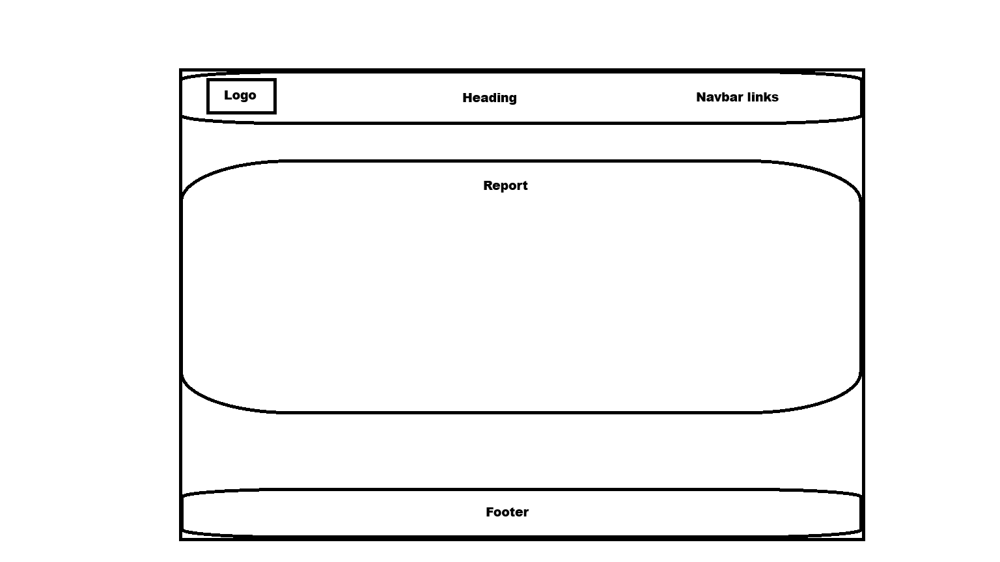

# Ballalyze ⚽📊

Ballalyze is a simple football data analytics demo project built with **HTML** and **CSS**.
The goal of this project is to practice semantic HTML structure, accessibility features (ARIA roles, labels), and modern layout techniques using **CSS Grid** and **Flexbox**.

*The project is deployed on GitHub Pages and can be viewed* [here](https://tarik-box.github.io/PP1-Idea-0/)

## Features:

* Responsive layout using CSS Grid and Flexbox.
* Semantic HTML elements (`<header>`, `<main>`, `<section>`, `<aside>`, `<footer>` .....).
* Multiple pages: Home, About, Report, Contact,Statistics .
* Accessible design with **ARIA labels** for screen readers.
* Stylish hover effects and smooth transitions in CSS.
* Interactive navigation bar with hover and active states.
* "About Us" section for presentation.
* Player cards for presenting information (non-clickable).

## Project Structure:

##### Assets :

│── assets/ |── images/       # Project Images

│── assets/ |── icons/        # Project Icons

│── assets/ |── css/style.css       # CSS styling

##### Pages :

│── about.html	       # About Html file

│── contact.html	        # Contact Html file

│── index.html       # Main HTML file

│── reports.html       # Report Html file

│── statistics.html        # Statistics Html file

##### Documetation :

│── README.md        # Project documentation

## Technologies Used:

- **HTML5**
- **CSS3** (Grid, Flexbox, animations)

# About:

Ballalyze is designed as a learning project for front-end development training.
It simulates a small-scale football analytics platform where users can view statistics, player comparisons, and insights in a clean and modern interface . it also part of bigger personal project that one day will find the light .

## User Experience (UX):

##### User Stories :

- **As a football fan**, I want to see player statistics so I can compare players visually.
- **As a recruiter**, I want to navigate the site easily to find key player info.

### Wireframes:

Home Page wireframe Example :

Other Pages ( Report , About and Contact ) wireframe Example :



## 📸 Preview :

Am I Responsive result :
[link](https://ui.dev/amiresponsive?url=https://tarik-box.github.io/PP1-Idea-0/index.html)

Example images :


## Author :

Created by *Tarik Ataia*
This project is part of my front-end development learning journey as well as a vision of very big Project

## Disclamer:

All icons and images used on this website are provided strictly for educational and learning purposes only.

## Installation

Clone the repository:

```bash
git clone https://github.com/Tarik-Box/PP1-Idea-0.git
```

Open `index.html` in your browser to view the project locally.

## Usage

* Navigate through different pages using the navbar.
* Hover over navigation links to see the active state highlight.
* The layout is responsive and adapts to different screen sizes.

## Credits / Attributions

- *HTML5* and *CSS3* for structure and styling.
- Icons sourced from [FontAwesome](https://fontawesome.com/).
- Images sourced from Google Images.
