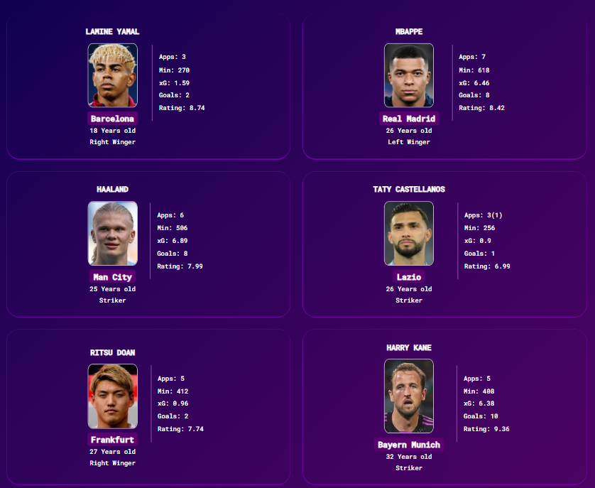

# Ballalyze ⚽📊

Ballalyze is a football data analytics demo project built with **HTML5** and **CSS3**.
The goal of this project is to practice semantic HTML structure, accessibility features (ARIA roles, labels), and modern layout techniques using **CSS Grid** and **Flexbox**.

Ballalyze enables users to explore player statistics, compare performance metrics, and gain insights through a clean and modern interface.
The project is intended for football enthusiasts and recruiters looking to analyze player performance.


*The project is deployed on GitHub Pages and can be viewed* [here](https://tarik-box.github.io/PP1-Idea-0/)

---

## Table of Contents

- [Features](#features)
- [Project Structure](#project-structure)
- [Technologies Used](#technologies-used)
- [Installation](#installation)
- [Testing](#testing--how-to-test)
- [Deployment](#deployment)
- [Author](#author)
- [Credits](#credits--attributions)

## Features:

### Existing Features

* **Navigation Bar**

The navigation bar is available across all pages. It helps users easily navigate between sections (Home, About, Reports, Contact, and "Statistics on Smaller Devices").

The active page is highlighted and underlined for better orientation.


* **The Landing Page**

The landing page introduces the project with a clear headline and football-themed visuals, helping users immediately understand the website’s purpose.


* **Player Cards Section**

Displays featured players with quick insights. This provides users with a quick overview of performance highlights without requiring them to delve into detailed reports.



* **Reports Page**

Provides a summarized performance report for 'Player of the week'. This feature helps recruiters and enthusiasts access quick evaluations of players.


* **Statistics Section**

On large devices, it is integrated directly into the main page, while on smaller devices, it appears as a dedicated page. It highlights key player attributes in a visual way.


* **About Page**

Explains the goal and scope of the project. This ensures new users understand the vision and target audience of Ballalyze.


* **Contact Page**

Includes a simple contact form where users can send messages. It improves communication and allows feedback or inquiries about the project.


* **Footer Section**

Contains relevant information and links. It gives users a consistent closing element across the site, supporting navigation and project credibility.


* **Responsive Design**

The site is fully responsive across devices (desktop, laptop, tablet, mobile). This ensures accessibility and usability for all screen sizes.

[Am I Responsive !](https://ui.dev/amiresponsive?url=https://tarik-box.github.io/PP1-Idea-0/)

*Image provided at top.

*More images :

```
assets/images/readme/responsive
```

---

### Features Left to Implement

- Make player cards dynamic by integrating real-time data via APIs.
- Connect the project to a backend database for efficient data management.
- Expand reporting capabilities with detailed and customizable player analytics.
- Add advanced search and comparison pages for deeper insights.
- Explore additional features and enhancements as the project evolves.

---

## Project Structure

##### Assets:

│── assets/
│   ├── images/       # Project Images
│   ├── icons/        # Project Icons
│   └── css/style.css # CSS styling

##### Pages:

│── index.html       # Main HTML file
│── about.html       # About page
│── contact.html     # Contact page
│── reports.html     # Report page
│── statistics.html  # Statistics page

##### Documentation:

│── README.md        # Project documentation

---

## Technologies Used

- **HTML5**
- **CSS3** (Grid, Flexbox, animations)

---

## Installation

Clone the repository:

```bash
git clone https://github.com/Tarik-Box/PP1-Idea-0.git
```

*The project can be fully inspected via the GitHub repository source code.*

Repository link: [Ballalyze on GitHub](https://github.com/Tarik-Box/PP1-Idea-0)

---

## Testing / How to Test

This section explains how to test the functionality, responsiveness, and overall usability of the **Ballalyze** project.

### 1. Navigation Testing

- Click through all navigation links in the Navbar (`Home`, `About`, `Reports`, `Contact`, and `Statistics` on Smaller devices) to ensure they direct to the correct sections or pages.
- Check that the active page is highlighted and underlined in the Navbar.
- **Note:** Player cards are non-clickable and do not link to other pages.
- On the **Reports** page, users can view summaries of player performance.
- On the **About** page, users can learn about the project and its purpose.
- On the **Contact** page, users can view the contact form (if implemented) or contact information for inquiries.

### 2. Responsiveness Testing

Open Chrome DevTools (F12) or any browser developer tools.

- Use the device toolbar to simulate different screen sizes:

  - Desktop (1920px, 1366px)
  - Laptop (1280px, 1024px)
  - Tablet (768px, 600px)
  - Mobile (375px, 320px)
- Verify that the layout adjusts correctly, text is readable, and images scale appropriately.
- Ensure navigation and content remain usable at all breakpoints.

### 3. Content Verification

Check each page (`index.html`, `about.html`, `reports.html`, `contact.html`, `statistics.html`) for:

- Correct headings, paragraphs, and sections.
- Proper display of images and icons.
- Consistent design and spacing.

### 4. Validator Testing

* HTML

All HTML pages (`index.html`, `about.html`, `contact.html`, `reports.html`, `statistics.html`) were tested using the

 [W3C Markup Validation Service](https://validator.w3.org/nu/?doc=https%3A%2F%2Ftarik-box.github.io%2FPP1-Idea-0%2Findex.html).

All pages passed with no errors.

* CSS

The CSS file (`style.css`) was tested using the [W3C Jigsaw CSS Validation Service](https://jigsaw.w3.org/css-validator/).

- **Style File**

✅ Validation passed with **no errors**.
  ⚠️ *One minor warning is shown related to Google Fonts import, which is an external resource and not part of the authored CSS.*


---

## Lighthouse Testing (Google Chrome DevTools)

The project was tested using **Lighthouse** in Google Chrome DevTools to measure performance, accessibility, best practices, and SEO.

### Desktop Results (PC)

- **Performance:** 95
- **Accessibility:** 💯 100
- **Best Practices:** 💯 100
- **SEO:** 💯 100


---

---

### Mobile Results

- **Performance:** 62
- **Accessibility:** 💯 100
- **Best Practices:** 💯 100
- **SEO:** 💯 100


*These results confirm that the site is highly accessible and follows best practices, with excellent SEO. Performance is strong on desktop and can be optimized further for mobile devices.*

---

#### Wireframes:


more :

```
assets/images/readme/wireframes
```

---

## Deployment

The site was deployed to GitHub Pages. The steps to deploy are as follows:

* In the GitHub repository, navigate to the Settings tab.
* From the Code and automation section on the left, select the Pages.
* From the Source drop-down menu, select the main branch.

Once the main branch has been selected, the page will be automatically refreshed with a detailed ribbon display to indicate the successful deployment.

*The project is deployed on GitHub Pages and can be viewed* [here](https://tarik-box.github.io/PP1-Idea-0/)

---

## Author

Created by *Tarik Ataia.*
This project is part of my front-end development learning journey as well as a vision for a larger personal project.

---

## Disclaimer

All icons and images used on this website are provided strictly for **educational and learning purposes only**.

---

## Credits / Attributions

### Content

* *HTML5* and *CSS3* for structure and styling.
* The text content used in paragraphs throughout the website was generated with the assistance of AI (ChatGPT).
* Icons sourced from [Icons8](https://icons8.com/) under a free-to-use license.
* Players' Data/Statistics copied from [WhoScored](http://whoscored.com/)
* 

### Media

* Images sourced from Google Images (used for educational purposes only).
* Logo generated with the assistance of AI (ChatGPT).
* Embedded video sourced from YouTube channel: [NOTIZIE DI OGGLAZIO ULTIME NOTIZIE](https://www.youtube.com/@NOTIZIEDIOGGILAZIOULTIMENOTIZI)

***All icons, images, and data used on this website are provided strictly for educational and learning purposes only.***

---
